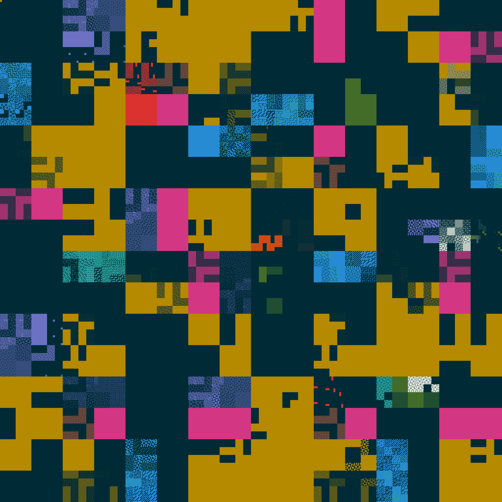
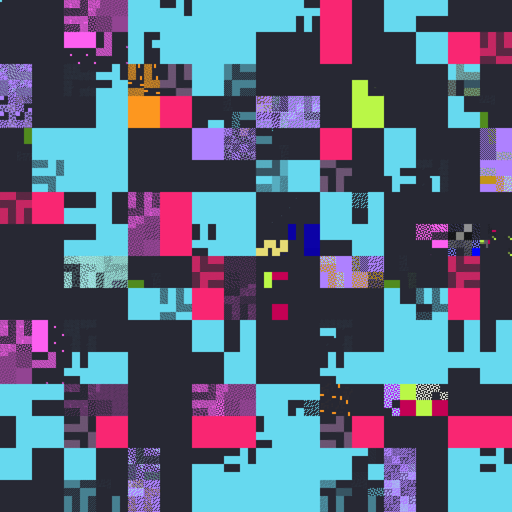

# ARM Analysis and Visualization



This images are a visual representation of the ARM64 instruction, with all
instructions plotted over a Hilbert curve and colored according to their
instruction class (`general`, `float`, `advsimd`, `sve`, etc...).

This is a set of tools for analyzing and visualizing the ARM64 architecture.
The tools parse the ARM machine readable architecture (MRA) and can generate
images and data sets. These tools are not particularly optimized, so generating
the data files may take a lot of space.

The tools consist of

* `arm-classify`: creates a JSON record of every instruction encoding type.
* `arm-gen`: generates a map of all ARM64 instructions to their encoding type.
* `arm-map`: generates a list of all blocks of 256 ARM64 instructions, and the
  weight of each instruction class within the block.
* `arm-vis`: generates a PNG file from a mapping by plotting the instructions
  over a Hilbert curve and using a palette of colors to represent different
  instruction classes.

# Generating Images

To generate the images from scratch, first download the MRA for AArch64 and extract it. Then run the following commands, which may take a long time (multiple hours) and use about 9G of disk space. Long commands will print the execution percentage as they run.

```
$ arm-classify MRA_ISA > data/arm64.json
$ go run cmd/arm-gen/decode_gen.go data/arm64.json > cmd/arm-gen/decode.go # regenerate decode.go
$ go install ./cmd/arm-gen # rebuild arm-gen
$ arm-gen -o data/arm64.dat
$ arm-map -data data/arm64.dat -json data/arm64.json > data/arm64.map
$ arm-vis -o img/arm64.png -theme monokai data/arm64.map
```


